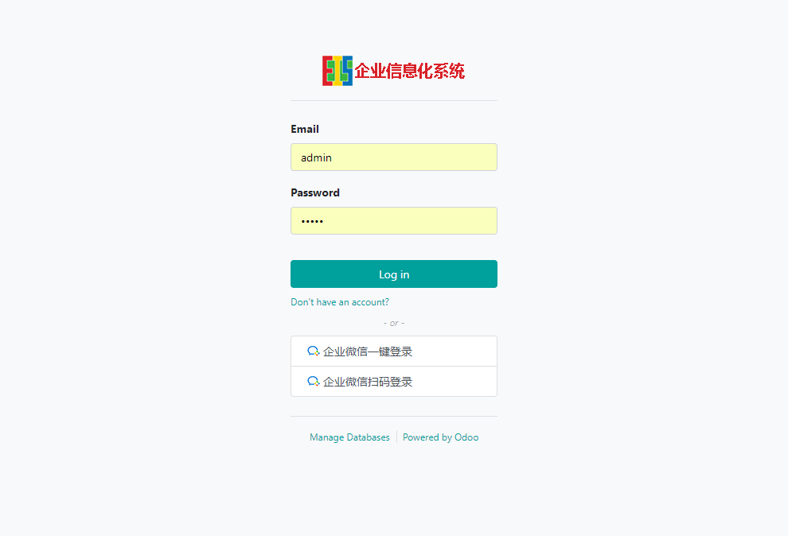
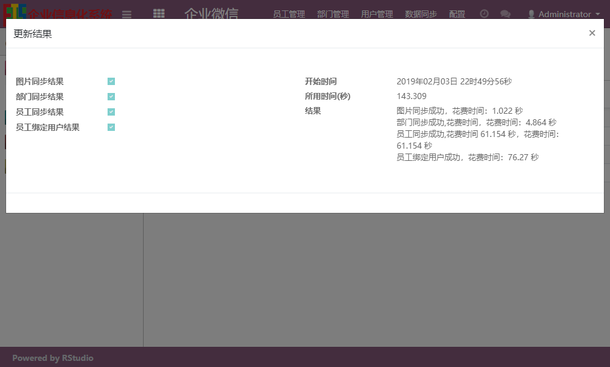

# 企业微信 For Odoo 12.0
[](doc/install/index.md)
[](doc/help/index.md)

### 功能介绍

1. （完成）同步企业微信讯簿部门及人员到HR
2. （完成）系统任务同步和手动同步企业微信讯簿离职员工到HR
3. （进行中，准备使用多线程)将头像和二维码下载方式由开始的载入内存改成直接下载到本地，并判断本地与远程的一致性。
同时将图片同步功能独立出来，因为发现在Linux下同步一个头像图片要4-5秒钟的时间，同步二维码就快很多。
4. （完成）从HR中标记企微员工生成User(默认门户用户)，可以在用户列表中"动作"中更改用户类型

    "内部用户"对于企业版来说付费账号，对于社区版来说会占用系统资源;
    
    "门户用户"是免费用户，仅可以访问前台网站，不占用系统资源.

5. (完成)企业微信APP内一键登录,企业微信扫码登录
6. (进行中)企业微信扫码修改用户密码
7. (未进行)企业微信通知功能

### 软件说明
1. wxwork_base  基础模块
2. wxwork_contacts  通讯簿同步模块
3. wxwork_auth_oauth 企业微信APP内一键登录,企业微信扫码登录
4. wxwork_reset_password 登录页面和后台用户首选项中使用扫码重置密码

### 安装说明

1. 使用pip安装numpy、opencv-python,用于比较本地的图片（头像和二维码）和企业微信的是否一致
    ```bash
    pip install numpy opencv-python -i https://pypi.doubanio.com/simple
    ```

### 使用说明

1. 安装相关模块
2. 在"企业微信"→"设置"中进行配置，配置页面中有详细说明
3. 在部署在Debian上，进行企业微信同步测试，发现失败，查看日志发现有如下日志：
    ```bash
    odoo.service.server: Thread <Thread(odoo.service.cron.cron0, started daemon 140477819664128)> virtual real time limit (120/120s) reached.
    ```
   解决方案,在 /etc/odoo/odoo.conf 添加如下参数：
   ```editorconfig
   limit_time_cpu = 600
   limit_time_real = 1200 
   ``` 
   使用以下命令实时查看odoo运行日志，如发现CPU time limit和virtual real time limit，将limit_time_cpu和limit_time_real改动合适为止：
   ```bash
   tail -f /var/log/odoo/odoo-server.log 
    ```
4. 初次同步操作建议，图片同步→向导同步→开启自动同步，不然很容造成超时。

### 下载分支12.0 最新的代码到本地的wxwork文件夹

```bash
git clone git@gitee.com:rainbowstudio/wxwork.git --depth 1 --branch 12.0 --single-branch wxwork 
```

### 图片展示





